# Projekt DevOps: Aplikacja Flask + PostgreSQL + NGINX + Docker + CI/CD + IaC (Bicep)

## Opis projektu

Projekt przedstawia kompletną konfigurację środowiska aplikacyjnego w architekturze kontenerowej z użyciem:

- **Flask (Python)** – aplikacja webowa  
- **PostgreSQL** – baza danych  
- **NGINX** – reverse proxy  
- **Docker** – konteneryzacja  
- **Docker Compose** – orkiestracja usług  
- **Pytest** – testy jednostkowe  
- **GitHub Actions** – CI/CD  
- **Azure Bicep** – Infrastructure as Code  

Projekt spełnia wszystkie wymagania zadania:  
wieloetapowy Dockerfile, migracje, seedowanie danych, testy, CI/CD oraz IaC.

---

# Struktura katalogów projektu
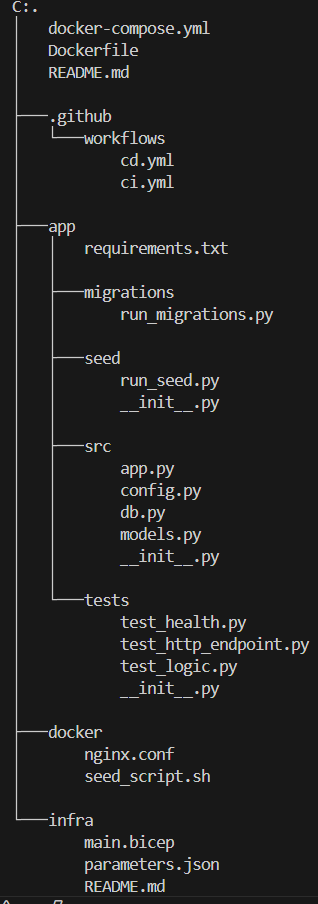

---

# Instalacja i uruchomenie 

## Budowa obrazów
- docker compose build:

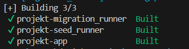

## Uruchomienie usług
- docker compose up -d:

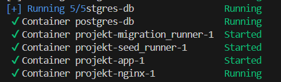

## Sprawdzenie statusu kontenerów
- docker compose ps:

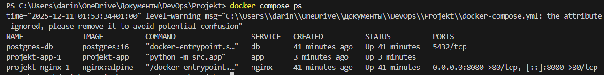

---

# Endpointy aplikacji

Aplikacja działa na porcie 8080 poprzez NGINX.

## Sprawdzenie zdrowia aplikacji

http://localhost:8080/health

## Endpoint testowy

http://localhost:8080/ping

## Odczyt użytkowników z bazy

http://localhost:8080/users

---

# Migracje bazy danych

Migracje wykonywane są przez kontener:
- migration_runner

Ręczne uruchomienie:
- docker compose run --rm migration_runner

Skrypt tworzy tabelę users na podstawie modeli SQLAlchemy.

---

# Seedowanie danych

Seeder uruchamia kontener:
- seed_runner

Wygenerowane pliki trafiają do wolumenu seed_output:
- users.csv

- data.json

- seed.log
  
Uruchomienie ręczne:
docker compose run --rm seed_runner

---

# Testy jednostkowe (pytest)

## Uruchamiane poprzez warstwę test w Dockerfile:

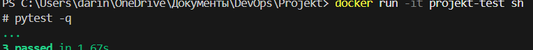

---

# Usługi Docker Compose

Poniższa tabela przedstawia wszystkie usługi zdefiniowane w pliku `docker-compose.yml`
oraz ich przeznaczenie:

| Serwis             | Opis                               |
|--------------------|-------------------------------------|
| **db**             | PostgreSQL – baza danych            |
| **migration_runner** | Jednorazowe migracje bazy danych   |
| **seed_runner**      | Seedowanie bazy – generowanie danych startowych |
| **app**            | Aplikacja Flask uruchamiana w kontenerze |
| **nginx**          | Reverse proxy kierujący ruch HTTP do aplikacji Flask |

---

## Sieci

Projekt korzysta z dwóch oddzielnych sieci Dockerowych:

- **front_net** – sieć publiczna, komunikacja NGINX → Flask  
- **back_net** – sieć prywatna, komunikacja Flask → PostgreSQL  

---

## Wolumeny

Używane wolumeny Docker umożliwiają trwałe przechowywanie danych:

- **db_data** – przechowuje dane PostgreSQL  
- **nginx_logs** – logi serwera NGINX  
- **seed_output** – pliki wygenerowane przez skrypt seedujący  
  (np. `users.csv`, `data.json`, `seed.log`)  

---

# CI – GitHub Actions (Continuous Integration)

Plik konfiguracyjny:  
`.github/workflows/ci.yml`

Pipeline CI uruchamia się automatycznie przy **push** lub **pull request**.  
Wykonuje następujące kroki:

1. **Checkout** – pobranie kodu z repozytorium  
2. **Konfiguracja Docker Buildx**  
3. **Logowanie do rejestru kontenerów**  
4. **Budowa obrazu w etapie builder**  
5. **Uruchomienie testów (pytest) w etapie test**  
6. **Budowa finalnego obrazu aplikacji**  
7. **Wysłanie obrazu do rejestru (ACR / GHCR)**  
8. **Skanowanie bezpieczeństwa CodeQL**

## Sekrety wymagane w repozytorium:

- `REGISTRY_URL`  
- `REGISTRY_USERNAME`  
- `REGISTRY_PASSWORD`

Sekrety te używane są do uwierzytelnienia podczas pushowania obrazów.

---

# CD – GitHub Actions (Continuous Deployment)

Plik konfiguracyjny:  
`.github/workflows/cd.yml`

Pipeline CD może być uruchamiany:

- ręcznie (workflow_dispatch)  
- automatycznie po tagu  

Pipeline wykonuje następujące kroki:

1. Pobranie obrazu z rejestru (`docker pull`)  
2. Aktualizację usług (`docker compose pull`)  
3. Ponowne uruchomienie środowiska (`docker compose up -d`)  

## Wymagania:

CD wymaga **self-hosted runnera**, ponieważ:

- musi mieć dostęp do Dockera  
- musi móc wykonać komendy `docker compose`  
- działa na lokalnym lub serwerowym środowisku, nie w GitHub Cloud  

---

# IaC – Azure Bicep

Folder `infra/` zawiera pliki odpowiedzialne za definiowanie infrastruktury w formie kodu:

- **main.bicep** – główny szablon Bicep (tworzy ACR oraz opcjonalnie Storage Account)  
- **parameters.json** – zestaw parametrów używanych podczas wdrożenia  
- **README.md** – instrukcja uruchomienia infrastruktury w Azure  

Wdrożenie:

az login
az group create -n rg-flask-devops -l westeurope

az deployment group create \
  --resource-group rg-flask-devops \
  --template-file main.bicep \
  --parameters @parameters.json

---

# Weryfikacja działania projektu

## 1. Weryfikacja migracji

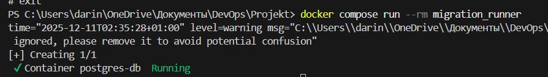

## 2.Weryfikacja seedera

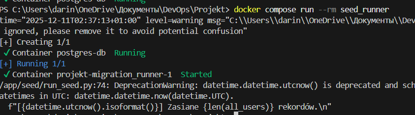

Sprawdzenie plików seedera:

Lista plików:

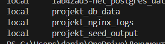

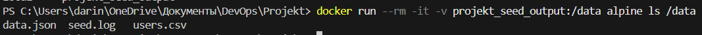

Podgląd logu:

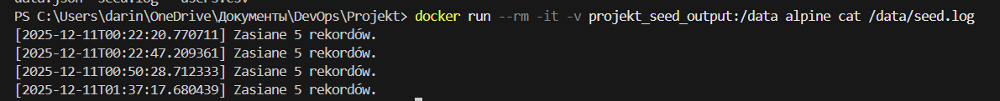

## 3. Weryfikacja endpointów aplikacji
- http://localhost:8080/health 

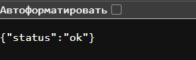

- http://localhost:8080/ping 

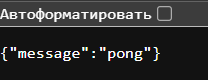

- http://localhost:8080/users 

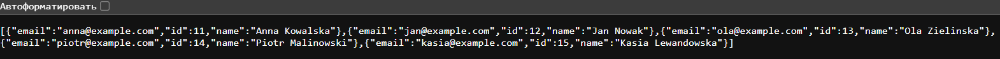

## 4. Weryfikacja logów NGINX

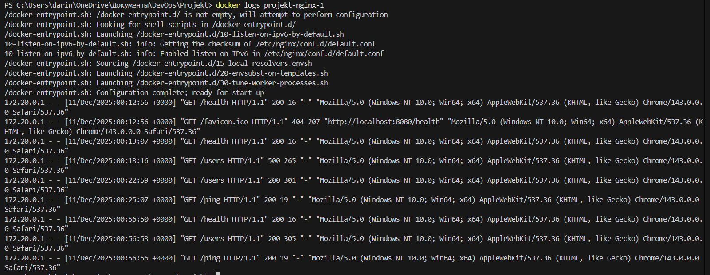

